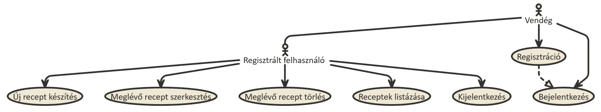
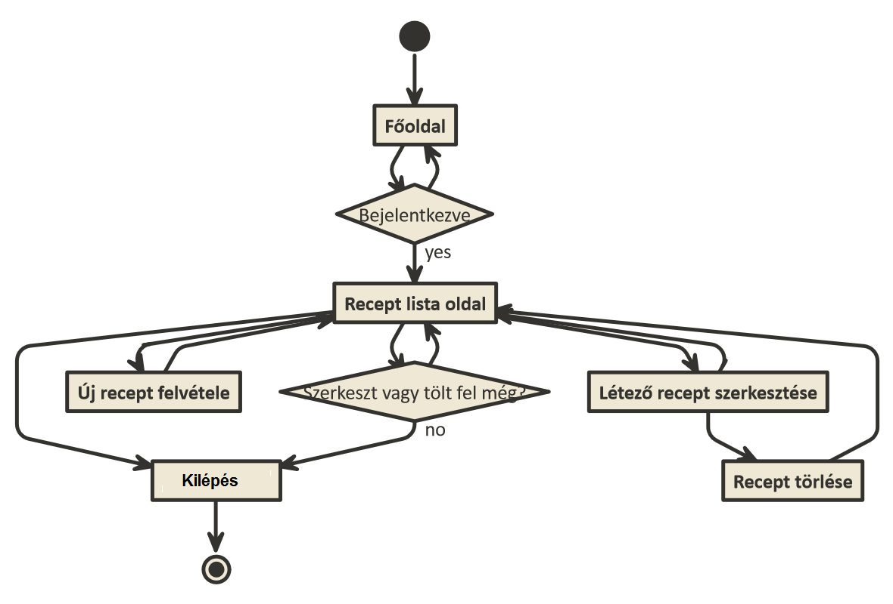
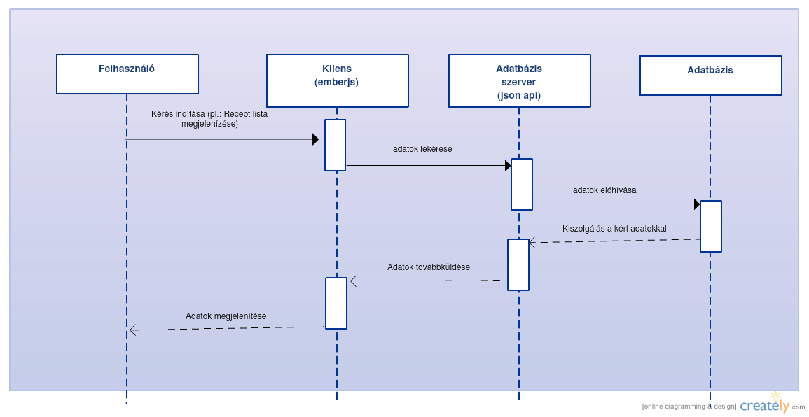
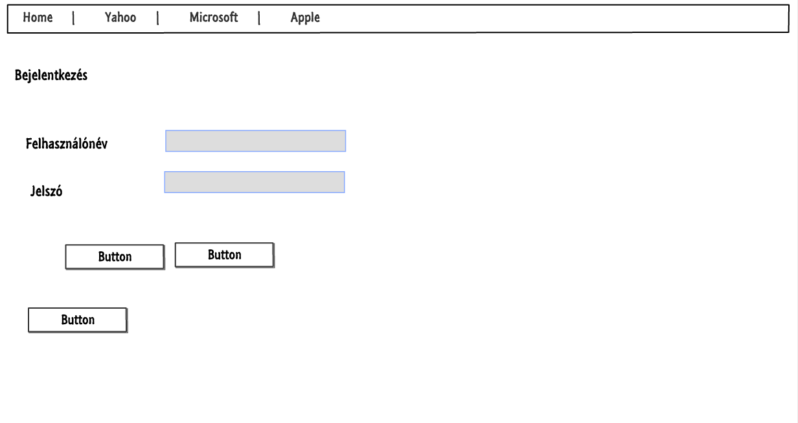
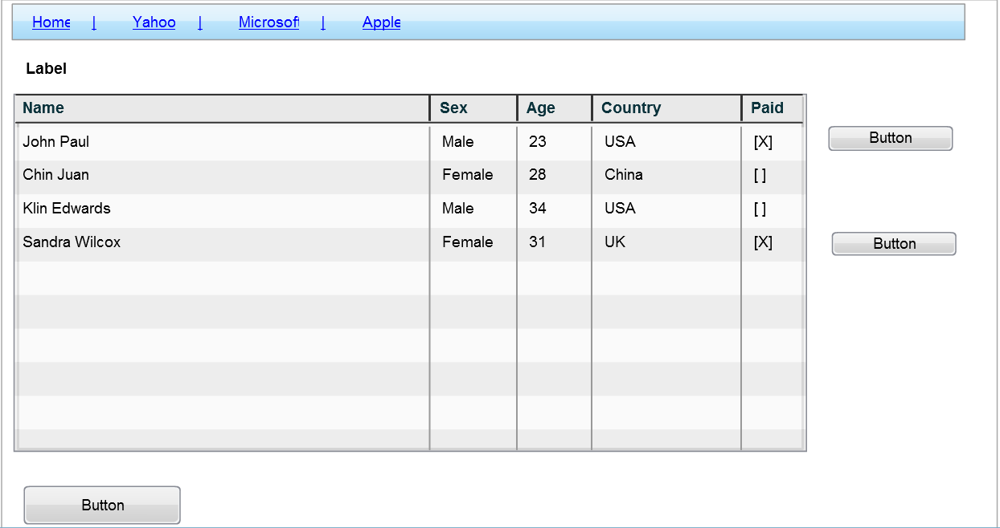
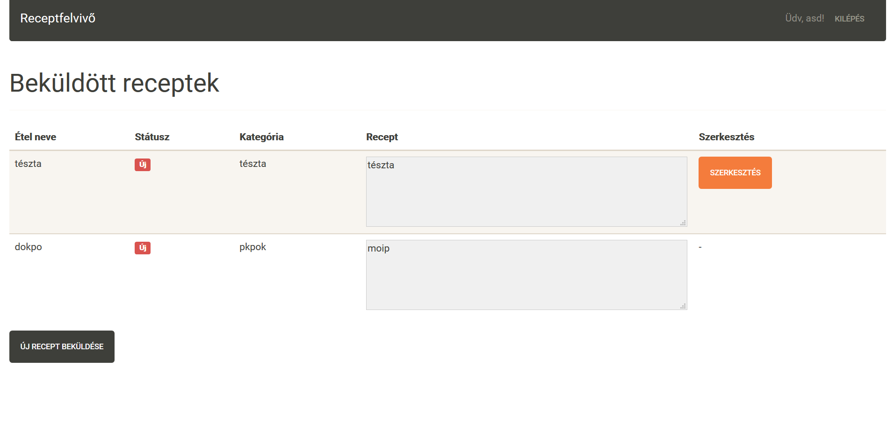
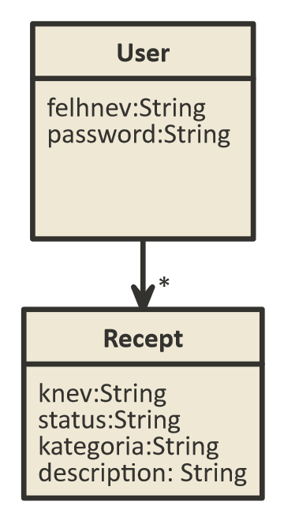
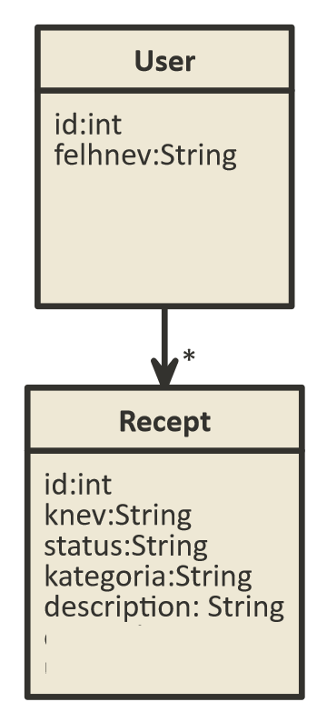

# Harmadik beadandó dokumentáció
=============================

## Követelményanalízis

### Követelmények
####Funkcionális elvárások
* Regisztráció az oldalra
* bejelentkezés az oldalara
* recept feltöltése az oldalra
* receptek szerkesztése
* receptek törlése

####Nem funkcionális elvárások
* letisztult felület
* egyszerű kezelhetőség

### Használateseti-modell

### Szekvencia-diagram

## Tervezés

#### Oldaltérkép
* Főoldal
  - Bejeletkezés
    * Recept lista oldal
    * Új recept felvétel
    * kijelentezés
    * recept szerkesztése
      - Recept törlése
  - Regisztráció

#### Végpontok
* GET /: főoldal
* GET /login: bejelentkezés
* POST /login: bejelentkezési adatok küldése
* GET /logout: kijelentkezés
* GET /signup: regisztráció
* POST /signup: regisztrációs adatok küldése
* GET /receptek/list: receptek listázása
* GET /receptek/new: új recept
* POST /receptek/new: új recept felküldése
* GET /receptek/szerkeszt/:id: receptszerkesztő
* POST /receptek/szerkeszt/:id: szerkesztett recept felküldése
* GET /receptek/delete/:id: recept törlése

#### Oldalvázlatok

#### Designe terv

#### Adatmodell

#### Adatbázisterv

## Implementáció

### Fejlesztői környezet bemutatása
* Cloud9, felhőalapú IDE
* GitHub, online verziókövető rendszer

### Könyvtárstruktúrában lévő mappák funkciójának bemutatása
* node_modules: az npm modulok mappája
* bower_components: front-end package manager modulok
* pods/application/config: ember konfiguráció
* pods/*/controller.js: funkciók
* pods/*/route.js: megjelenítendő adatok a template-nek
* pods/*/template.hbs: oldalak sablonjai

## Tesztelés

### Tesztelési környezet bemutatása
* Cloud9, felhőalapú IDE

### Egységtesztek: Legalább egy adatmodell tesztelése
* felhasználó regisztrációja: sikeres
* új recept létrehozása: sikeres
* recept szerkesztése: sikeres
* recept törlése: sikeres

### Tesztesetek felsorolása
* már létező felhasználónévvel nem lehet regisztrálni
* rossz jelszóval nem lehet belépni
* nem lehet üresen hagyni semmilyen mezőt a recept feltöltésénél
* ha a recept szerkesztése után, a "mégse" gombra nyomunk, nem változik meg a recept státusza
* nem lehet üres mező a recept szerkesztése után sem
* csak az adott felhasználó saját receptjeinél jelenik meg a szerkesztés gomb
* més felhasználó receptjeit az url-t átírva sem lehet szerkeszteni vagy törölni

## Felhasználói dokumentáció

### A futtatáshoz ajánlott hardver-, szoftver konfiguráció
A Cloud9 használatával lehet futtatni a programot.
### Telepítés lépései: hogyan kerül a Githubról a célgépre a program
Nincs szükség telepítésre, a program megtakinthető: http://bead3jo-hobsar.c9users.io:8080
### A program használata
Cloud9-on a Run gomb segítségével futtatható a program.
vagy a http://bead3jo-hobsar.c9users.io:8080 címen érhető el.